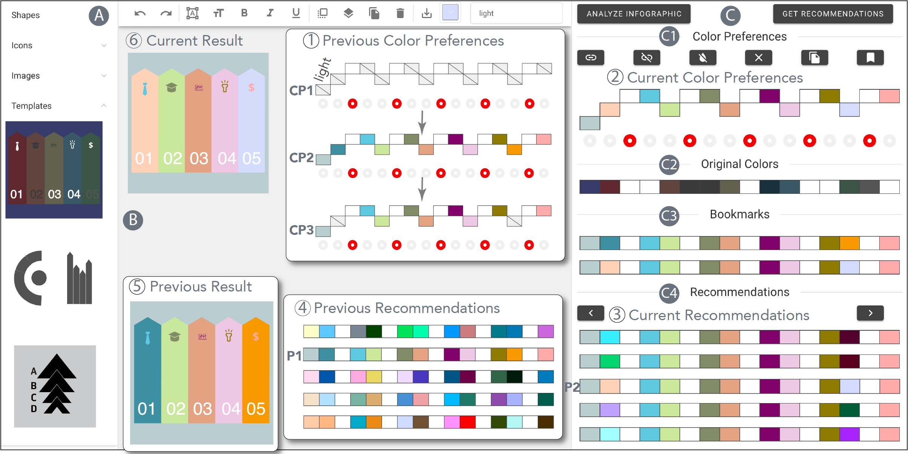
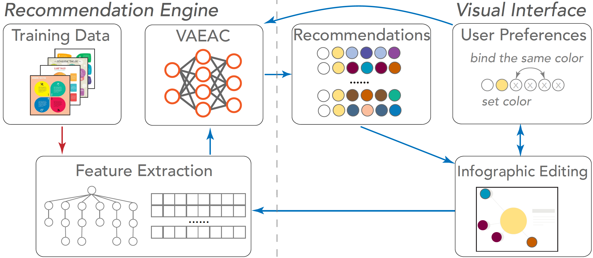
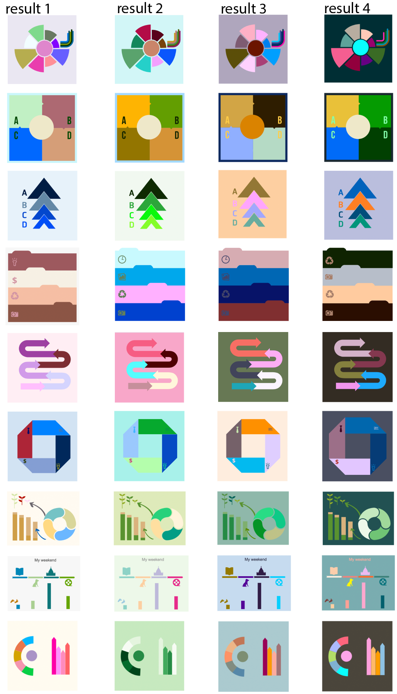
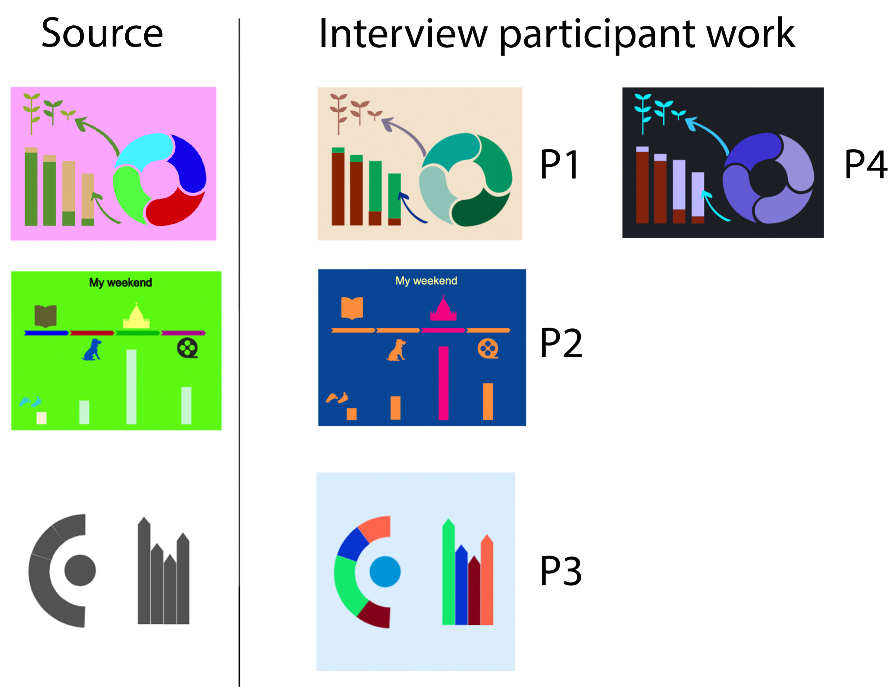

# InfoColorizer



This repository contains code and study materials for the paper _InfoColorizer: Interactive Recommendation of Color Palettes for Infographics,_ contributed by Lin-Ping Yuan, Ziqi Zhou, Jian Zhao, Yiqiu Guo, Fan Du, and Huamin Qu.

----
## Introduction
InfoColorizer is a tool that allows users to effectively obtain high-quality color palettes during infographics creation. 
It consists of a recommendation engine and a visual interface.
From a large infographic dataset, we extract a set of features that embeds both structure and color information of infographics (the red arrow). 
We then train a deep learning model, VAEAC, that characterizes good color design practices in the data, to construct our recommendation engine. 
With the visual interface, users can obtain recommended color palettes, specify various color preferences and constraints, preview and edit infographics, 
and retrieve new recommendations in an iterative manner (the blue arrows). 



## Demo Video
Check [here](https://youtu.be/FZvLt0AAIAI) for the demo video.

## Recommended Palettes Examples 



### Results generated by participants of the Interview Study:


Check [here](https://bit.ly/38zinpV) for more examples, including those generated by the users in the Controlled User Study. 

## Deployment
### Prerequisite:
[Node](https://nodejs.org/) and [Python](https://www.python.org/)
### Environment
- Vue 3.6.3
- python 3.6
### Setup the interface 

```
- cd frontend
- npm install
- npm run serve
```

### Start the server 
```
- cd backend
- pip install -r requirements.txt (suggest using virtual environment https://docs.python.org/3/tutorial/venv.html)
- bash run-data-backend.sh
```

